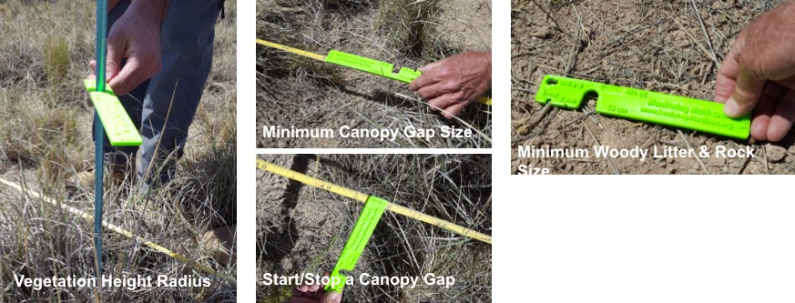
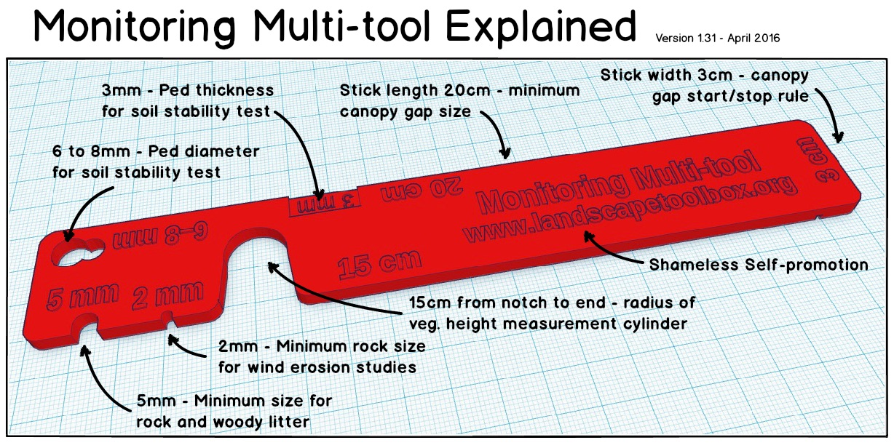
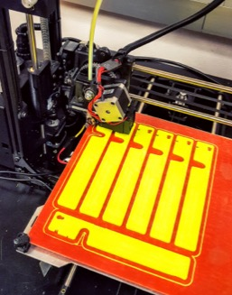
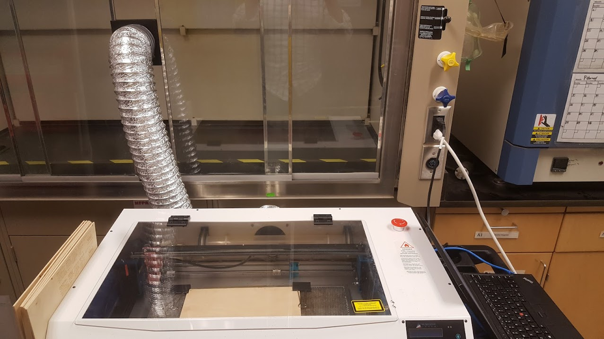

# The Monitoring Multitool

The Monitoring Multi-tool was created as an aid to training crews in how to implement the core methods and as a tool to help ensure high-quality monitoring data are being collected. The Multi-tool has the standard measurement units for implementing the core methods of line-point intercept (LPI), canopy gap intercept, vegetation height measurements, and soil aggregate stability. See below for a descriptions of the Multi-tool features.

More information on the Multitool is available at https://www.landscapetoolbox.org/tools/multi-tool/.

Originally the Monitoring Multitools were 3D printed. While this certainly worked, they were not durable enough. With the version 2.0 multitools, we switched to cutting them out of 1/8" (3mm) plywood with a laser cutter. This Repo contains the .STL model files for 3D printing and .SVG files for laser cutting. We used a Full Spectrum Laser Hobby Series laser and FSL's RetinaEngrave software. Cut files for this setup are provided, but unless you have that specific setup, you're probably better off creating your own cut files from the .SVGs.

## 3D Model files
 - [multitool_v2.0_body_w_text.stl](./multitool_v2.0_body_w_text.stl) - multitool with text/markings on the front only
 - [multitool_v2.0_body.stl](./multitool_v2.0_body.stl)  - No text on the multitools
 - [multitool_v2.0_body_text.stl](./multitool_v2.0_body_text.stl) - Text and markings only (for if you wanted to do something fancy like embed the text or print it in a different color).

## Laser cutter .SVG files
 - [MTool2-0.svg](./MTool2-0.svg) - Front of multitool, outline and text/markings
 - [MToolv2-0-back.svg](./MToolv2-0-back.svg) - back of multitool, outline and text/markings
 - [MToolv2-0_OutlineOnly.svg](./MToolv2-0_OutlineOnly.svg) - multitool outline only (no text/markings)

#### Multitools laid out to do 9 at a time
Nine multitools on a 12"x12" piece of plywood was the max that would fit on our FSL cutter
 - [MToolv2-0_front_x9.svg](./MToolv2-0_front_x9.svg) - Multitool (w/ text) front
 - [MToolv2-0-back_x9.svg](./MToolv2-0-back_x9.svg) - Multitool(w/ text) back
 - [MToolv2-0_x9_OutlineOnly.svg](./MToolv2-0_x9_OutlineOnly.svg) - Multitool outline only

The [Multitool_Laser_Instructions.docx](./Multitool_Laser_Instructions.docx) file gives instructions for the FSL Hobby Series laser using RetinaEngrave.
